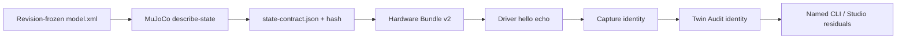

# Hardware State ABI

## Purpose

The Hardware State ABI is the normalized wire meaning of `qpos` and `qvel`
between a device Driver and Mujica. It prevents a correctly sized numeric array
from being mistaken for a correctly interpreted robot state.

## Contract generation

`hardware export` loads the exact Revision-frozen `model.xml` through the Python
Runtime and enumerates MuJoCo `jnt_qposadr` and `jnt_dofadr`. This deliberately
uses MuJoCo's compiled model rather than implementing another MJCF parser in
TypeScript.

The resulting `state-contract.json` contains:

- model, Assembly, and Runtime identity;
- every `qpos` and `qvel` coordinate with index, stable joint-derived name,
  component, unit, and coordinate frame;
- joint type, axis, reference position, and exact qpos/qvel index groups;
- actuator order and joint transmission where MuJoCo exposes it;
- right-handed `wxyz` quaternion convention;
- the Driver normalization requirement.

Coverage and uniqueness are closed invariants: coordinate indices must equal
`0..nq-1` and `0..nv-1`, with no duplicate names.

## Coordinate semantics

For a free root:

| Coordinates | Unit | Frame |
| --- | --- | --- |
| `position.{x,y,z}` | m | model world |
| `orientation.{w,x,y,z}` | unit quaternion | model-world-from-body |
| `linear-velocity.{x,y,z}` | m/s | model world |
| `angular-velocity.{x,y,z}` | rad/s | body local |

Hinge position/velocity is rad and rad/s about its body-fixed axis. Slide
position/velocity is m and m/s along its body-fixed axis. Ball-joint
orientation is a `wxyz` quaternion relative to its initial pose and velocity is
represented in its local tangent space.

These semantics follow MuJoCo rather than a vendor SDK. A Driver MUST reorder,
sign-correct, zero, scale, frame-transform, and quaternion-reorder native sensor
values before sending `state`.

## Identity flow

Bundle v2 includes `stateContractHash` in `bundleHash`, and integrity
verification re-hashes the file and checks its model/Assembly binding. The
Driver declares `state-abi-v1` and echoes the exact hash in hello. Capture
includes the hash in `captureHash`; Audit includes it in `auditHash`.
Verification Evidence for a v2 Bundle must name the same hash.

## Legacy evidence

Bundle v1 and its Captures remain immutable and readable. When they are selected
for replay or Audit, Mujica derives the exact same contract from the legacy
Bundle's frozen model and labels its authority
`derived-from-frozen-model`. It does not insert bytes into the old Bundle or
claim the old Driver negotiated the ABI. All new exports are v2 and
`bundle-frozen`.

## Audit and UI

Digital Twin Audit validates the supplied ABI against the model before reading
telemetry. Audit v1 supports a free root plus scalar hinge/slide joint
residuals; it fails closed on ball-joint residuals until quaternion-distance
reporting is implemented. Each transition contains named joint position and
velocity residuals, and the summary reports worst named joints. Studio shows
the ABI hash/authority and the highest residual joints for the selected
transition. Agent `twin inspect` returns the same objects.

State ABI evidence remains semantic compatibility evidence. It does not prove
that a physical encoder mapping is correct, verify hardware safety, promote a
Calibration, or grant actuation.

